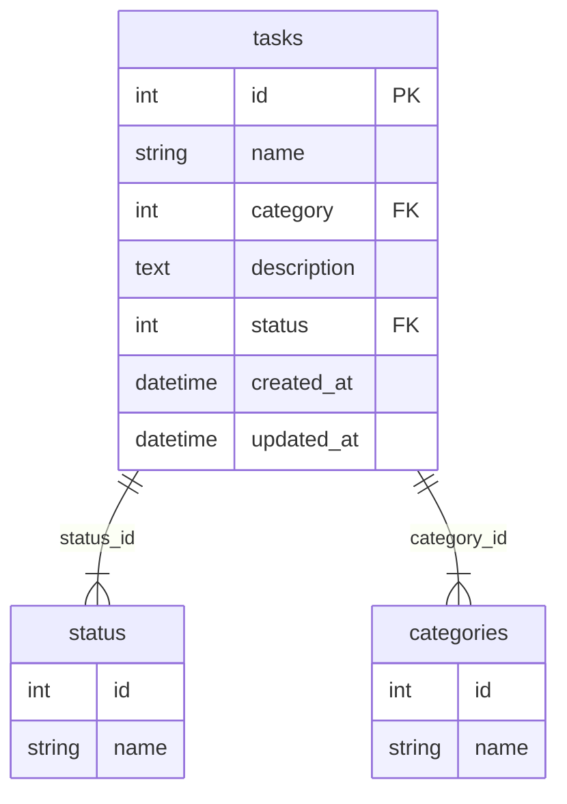

# Sampleapp

this is a sample full-stack application.

## teckstack

- backend: express
- ORM: knex
- DB: postgresql
- frontend react + vite

## database schema

```mermaid
erDiagram
    tasks {
        int id PK
        string name
        int category FK
        text description
        int status FK
        datetime created_at
        datetime updated_at
    }

    categories {
        int id
        string name
    }

    status {
        int id
        string name
    }

    tasks ||--|{ status: "status_id"
    tasks ||--|{ categories: "category_id"
```
